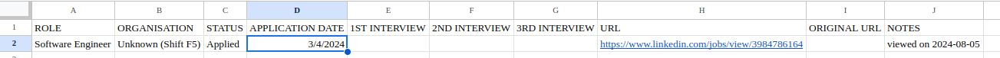
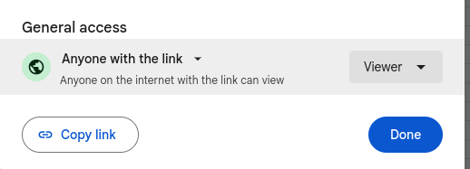

# Universal Credit job application journal logger (Docker server based application)

If you live in the UK and happen to be receving Universal Credit (UC) while looking for work, you will need to log your job search activities into the UC website. If you are applying for a lot of jobs, this can be a very tedious, manual process. And the UC website is not particularly user friendly (they should hire a UI/UX specialist). This script will help you automate the process of logging the jobs that you have applied for into the UC website.

## Prerequisites
 Docker to neinstalled on your operating system to run the docker file [see](https://docs.docker.com/engine/install/).

## Setup and installation

### Google sheets automation
For the follwing docker image to run and automate the upload of jobs succesful all jobs must be specified in google sheet document with the jobs specified in the same format as 

With the job applications in the correct format the user musst then use the click share option and be taken to this options page. 
 
Here the user must select anyone with link and then copy said link

Below is example link the user must identify their own FILE
    
    https://docs.google.com/spreadsheets/d/GS_SHEET_ID/edit?usp=sharing
    
and with it follow the credential instructions below.

### Credentials

First things, first - git clone this repo to your machine:

    git clone https://github.com/VikSil/UC_journal_automation.git

 
Add `credentials.env` file into the root directory with the following content:

    UC_SITE_USERNAME=YourLoginNameForUCWebsite
    UC_SITE_PASSWORD=YourPasswordForUCWebsite
    GS_SHEET_ID=encryptedmixofnumbers

Make sure that there are no spaces on either line in the `credentials.env` file

Previously this automation script was deployed on a windows local machine and required a manual chromedriver install. However, with with this docker implementation and the use of the [webdriver_manager](https://github.com/SergeyPirogov/webdriver_manager) package this is no longer required and is also automated.

All the user needs to do now is build dockerfile image by running the following command from within side the UC_journal_automation directory.

    docker build -t uc .    

🔴❗ IMPORTANT  🔴❗
* The names of the columns does not matter, but the sequence does.
* Make dure that APPLICATION DATE format is '%Y-%m-%d' or change DATE_FORMAT global variable in `main.py` file.
* STATUS column must contain `Applied` or `Unsuccessful`.
* Data from URL and NOTES columns will be submitted into the **Notes** field on the UC journal form.

## Execution

Before running this script, have your phone ready to receive an sms with the 2-factor authorisation code.

To start the docker run the following command from the within UC_journal_automation directory:

    docker run -it uc 3/3/2024

"3/3/2024 is example of month/day/year formatted cli argument which specifies dates later than this date to be uploaded to the UC Journal.

Because this is a docker container implementation for server automation no gui will pop up. All that is required of the user is their sms submission-key input to the cli. 

🔴❗ This is the only manual step. Wait for the script to resume work. 🔴❗

In 60 seconds after logging in the script will navigate to the journal page and start submitting data from the `data.csv` file into the UC website. Once the end of the `data.csv` file is reached, the script will wait for 60 seconds and then close the website.

## Disclaimer
The script is operational as of the date of submission to GitHub. There are no guarantees of maintanence.