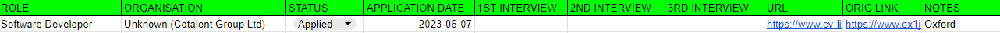
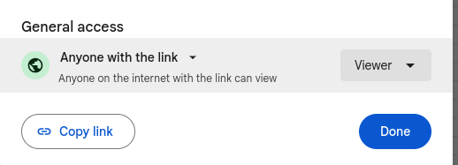

# Universal Credit job application journal logger (Dockerised)

If you live in the UK and happen to be receving Universal Credit (UC) while looking for work, you will need to log your job search activities into the UC website. If you are applying for a lot of jobs, this can be a very tedious, manual process. And the UC website is not particularly user friendly (they should hire a UI/UX specialist). This script will help you automate the process of logging the jobs that you have applied for into the UC website.

🔴❗ *This is an operating system agnostic solution. It uses command line and does not have a graphical interface. If you want to be able to see the website, while the script is running, GUI enabled version is [here](https://github.com/VikSil/UC_journal_automation/tree/GUI-supported) (tested on Windows only)* ❗🔴

## Prerequisites
 Docker installed on your operating system, and running Docker deamon. Installation instructions [here](https://docs.docker.com/engine/install/).

## Setup and configuration

Clone this repo to your machine:

    git clone https://github.com/VikSil/UC_journal_automation.git

Add `credentials.env` file into the root directory with the following content:

    UC_SITE_USERNAME=YourLoginNameForUCWebsite
    UC_SITE_PASSWORD=YourPasswordForUCWebsite

Make sure that there are no spaces on either line in the `credentials.env` file

## Data source
 
There is an option to either use a .csv file or source the data from a Google Sheets spreadsheet.
Whichever option you choose, add a configuration into `credentials.env` file for the date format that is used in the data source, e.g.:

    DATE_FORMAT=%Y-%m-%d

Make sure that APPLICATION DATE column format in your data source uses the same format.

### Local datasource

🔴❗ *If you use local data source option with this Dockerised version of the script, you will have to rebuild Docker image for each run to replace the `data_example.csv`. It is advised to use Google Sheets instead.* 🔴❗

Add into the root folder a `data.csv` file with the entries of job applications, that you want to submit to the UC website. The file should have the same format as `data_example.csv` file in this repo. When using local datasource:

* The names of the columns does not matter, but the sequence does.
* STATUS column must only contain values `Applied` or `Unsuccessful`.
* The file must contain only the new applications that you want to add into the UC journal (all lines will be processed). 

### Google Sheets datasource

Applications must be listed in Google Sheets spreadsheet in the following format:

Click on the "Share" button on upper right corner of the spreadsheet to be taken to this options page. 

 

Here, access must be configured to `Anyone with the link`.

Add configuration into `credentials.env` file to switch on this functionality and point the script to the Google Sheet to use.

    USE_GOOGLE_SHEETS=True
    GS_SHEET_ID=l0nG-AnD-S00ph1stiCAT3d-URL-T0_Th3-Work5h33t

The value for GS_SHEET_ID can be obtained either from the URL bar of the browser, or by clicking on the `Copy link` button in the screenshot above. The URL will look something like this:

    https://docs.google.com/spreadsheets/d/GS_SHEET_ID/edit?usp=sharing

When using Google Sheets as the data source:
 * STATUS and APPLICATION DATE columns have to be named exactly that.
 * STATUS column can contain different values, but only rows with values `Applied` or `Unsuccessful` will be processed.
 * If there are multiple tabs on the Google Sheet, the data must be in the first tab.
 * It is possible to configure the earliest application date to process.

🔴❗ *The following instructions detail start date configuration via environment variables. If you use this option with this Dockerised version of the script, you will have to rebuild Docker image for each run to update the date. It is advised to forego this configuration and instead use a comandline argument at execution time.* 🔴❗

In order to configure the earliest application date, add configuration to  `credentials.env` file, e.g.:

    START_DATE=2024-08-14

With `START_DATE` configured, the script will ignore all earlier application dates in the Google spreadheet. The format of `START_DATE` must match that of the `DATE_FORMAT` variable. `START_DATE` will only have effect if `USE_GOOGLE_SHEETS=True` is configured.  Configuring `START_DATE` will superceed comadline `--threshold-date` argument (see below).

## Docker Image

Once configuration is done, build a Docker image by running the following command from the root directory:

    docker build -t uc .    

This step will take 10-15 minutes.

## Execution

Before running this script, have your phone ready to receive an sms with the 2-factor authorisation code.

To start the Docker run the following command from the root directory:

    docker run -it uc -d 2024-08-14

Comandline argument `-d [date]` denotes the earliest application to be processed. The format of the date must match that of the `DATE_FORMAT` variable. This comandline argument will work only if the use of Google Sheets is configured and `START_DATE` variable is **not** configured. Please see [above](#Google-Sheets-datasource).

Shortly after starting the script you should receive an sms on your phone with a  2-factor authorisation code. You have 60 seconds to enter it into the console and press Enter.

🔴❗ **This is the only manual step. Wait for the script to resume work.** ❗🔴

As the script runs, output will be generated about the progress. 

## Disclaimer
The script is operational as of the date of the last commit to GitHub. There are no guarantees of maintanence.
